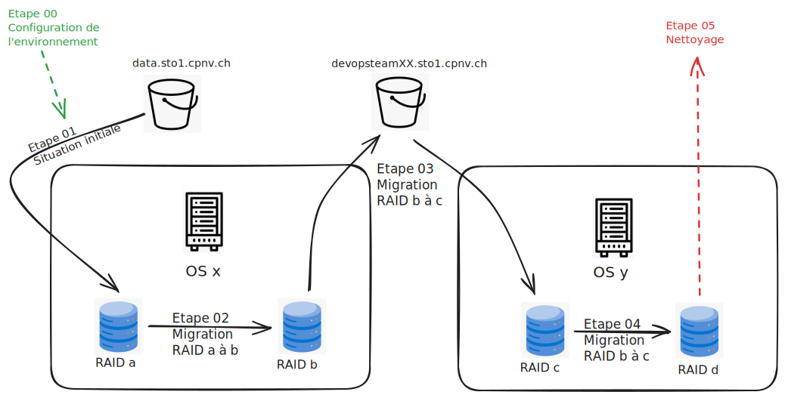

# README

Projet STO1 - 2024-2025

## Intention pédagogique

Afin de réaliser une révision ainsi qu'un approfondissement des connaissances et compétences acquises durant le module, il vous est proposé de réaliser un projet en équipe de 2 ou 3 techniciens.

Vous recevrez une situation de départ et différentes étapes d'un scénario à réaliser. Des données vous seront confiées en début de projet. Il s'agira, à l'aide des différentes technologiques que nous avons vues, réaliser des migrations entre différents RAIDs et différents systèmes d'exploitation afin d'amener les données à bon "port".

C'est également l'occasion de travailler sur une infrastructure "réaliste" et ainsi vous confronter à des contraintes de performances et de sécurité sur un cloud industriel.

## Objectifs opérationnels

Le projet sera décomposé en 6 étapes principales:

|Etape num|Titre                           |Détails|
|:--      |:--                             |:--    |
|0        |[Configuration des environnements](./Etape00_ConfigurationEnvironnement.md)|Prise en main de l'infrastructure cible|
|1        |[Situation intiale](./Etape01_SituationInitiale.md)          |Mise en place du premier RAID et intégration des données       |
|2        |[1ère migration](./Etape02_1ereMigration.md)                 |Migration RAID a à b       |
|3        |[2ème migration](./Etape03_2emeMigration.md)                 |Migration OS x à y + RAID b à c       |
|4        |[3ème migration](./Etape04_3emeMigration.md)                 |Migration RAID c à d       |
|5        |[Nettoyage](./Etape05_Nettoyage.md)                          |Suppression des configurations et données produites par le travail de migration|

## Infrastucture cible

[Récupérer le code eraser](./appendices/eraser.zip)

### Informations complémentaires

* La DMZ (public subnet) est commune à toutes les devopsteams.
  * Accès uniquement via le protocle SSH.
  * Chaque devopteam dispose d'un accès privé et limité.
* Un sous-réseau privé par devopsteam est également disponible.
    * L'intervalle d'adresse ipv4 est définie comme suit:
        * 10.0.X.0/28.
        * X mentionnant le numéro de votre équipe.

* Le bucket s3 dédié à votre équipe porte le nom suivant:
    * devopsteamXX.sto1.cpnv.ch
* Le bucket s3 livré par le client porte le nom suivant:
    * data.sto1.cpnv.ch

### Données confidentielles pour l'accès à l'infrastructure

Vous recevrez via un partage oneDrive dédié à votre devopsteam :

* Les accès à la DMZ (ip public + user name + ssh key).
* La configuration nécessaire pour la mise en place des tunnels ssh et rdp (private ips, ports and protocols).
* Les accès à votre sous-réseau privé:
  * instance linux (user name, ssh key).
  * instance windows (user name, pwd).
* Une paire de clés pour le cli d'AWS offrant l'accès au bucket du client.
* Une paire de clés pour le cli d'AWS offrant l'accès à votre bucket d'équipe pour le travail de migration.
* Une paire de clés pour le cli d'AWS offrant les actions permettant de faire des snaphots de vos instances et de vos volumes.

Note : ces données ne doivent jamais être publiées

## SLA
L'infrastructure AWS ne sera disponible que durant les heures de cours uniquement.

Les snapshots des instances et volumes sont assurés par les techniciens.

Pour des demandes de "restore", une issue doit être postée sur votre dépôt github, à l'attention du client.

## Livrables

Les devopsteams livrent le contenu suivant:

Sur leur dépôt github:

* Chaque étape de la migration est documentée, en utilisant les modèles de fichiers livrés.
* Le contenu produit doit permettre, en disposant des pré-requis mentionnés à chaque étape, de pouvoir redéployer la même infrastructure.

Sur leur infrastructure AWS:

* Un snapshot de chaque étape et de chaque machine et de leur volumes.
* Une infrastructure finale (os y + raid d), nettoyée de toutes les données temporaires liées à la migration.

Sur le partage oneDrive:

* Une capusle vidéo:
    * 10 min max (15 min pour l'équipe à trois membres)
    * Tous les membres d'équipes participent (qui peut être produite sur vos environnement locaux)
    * Décrivant en détail les commandes que vous passez ainsi que le résultat obtenu.

## FAQ

### Devons-nous utiliser des profils pour configurer le CLI ?

    Oui. Vous recevrez plusieurs paires de clé AWS en fonction des besoins.

### Quel est le contenu (data) à migrer ?

    Vous aurez environ 4 Go de données à intégrer (étape 01) et à migrer tout au long des étapes de modification de l'infrastructure.
    Ces données vous seront livrées via un bucket S3.
    Les données seront un mélange de différents types, tailles ordonnées dans une hiérarchie à plusieurs niveaux.