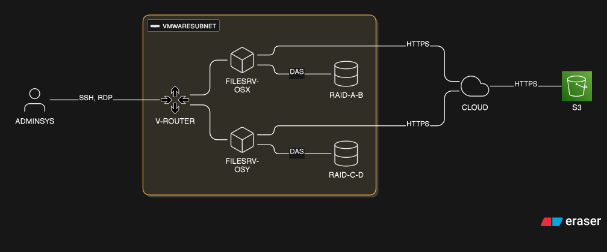

# README

Projet STO1 - 2025.2026

## Intention pédagogique

Afin d'évaluer les compétences acquises durant le module, un projet en équipe de 2 ou 3 techniciens.

Vous recevrez une situation de départ et différentes étapes d'un scénario à réaliser. Des données vous seront confiées en début de projet. Il s'agira, à l'aide des différentes technologiques que nous avons vues, de réaliser des migrations entre différents RAIDs et différents systèmes d'exploitation afin d'amener les données à bon "port".

C'est également l'occasion de travailler sur une infrastructure "réaliste" et ainsi vous confronter à des contraintes de performances et de sécurité sur un cloud industriel.

---

## Objectifs opérationnels

Le projet sera décomposé en 6 étapes principales:

|Etape num|Titre                           |Détails|
|:--      |:--                             |:--    |
|0        |[Configuration des environnements](./Etape00_ConfigurationEnvironnement.md)|Prise en main de l'infrastructure cible|
|1        |[Situation intiale](./Etape01_SituationInitiale.md)          |Mise en place du premier RAID et intégration des données       |
|2        |[1ère migration](./Etape02_1ereMigration.md)                 |Migration RAID a à b       |
|3        |[2ème migration](./Etape03_2emeMigration.md)                 |Migration OS x à y + RAID b à c       |
|4        |[3ème migration](./Etape04_3emeMigration.md)                 |Migration RAID c à d       |
|5        |[Nettoyage](./Etape05_Nettoyage.md)                          |Suppression des configurations et données produites par le travail de migration|

---

## Infrastucture cible

[Récupérer le code eraser](./appendices/infra.eraserdiagram)

---

### Informations complémentaires

* Les buckets s3 à utiliser sont les mêmes que ceux pour les laboratories.

* Le bucket s3 livré (15 GBs de données) par le client porte le nom suivant:
    * sto1-project-data
    * Pour récupérer les données, utilisez [la commande "sync"](https://docs.aws.amazon.com/cli/latest/reference/s3/sync.html)

---

## Livrables

Les devopsteams livrent le contenu suivant:

Sur leur dépôt github:

* Chaque étape de la migration est documentée, en utilisant les modèles de fichiers livrés (les dessins d'infrastructure).
* Le contenu produit doit permettre, en disposant des pré-requis mentionnés à chaque étape, de pouvoir redéployer la même infrastructure.

Sur le partage oneDrive (que vous créez et partagez avec l'enseignant:

* Une capusle vidéo:
    * d'une durée de 10 min max (15 min pour l'équipe à trois membres).
    * construite par tous les membres de l'équipe.
    * Décrivant en détail les commandes que vous passez ainsi que le résultat obtenu.

--

## Grille d'évaluation

|Critères|Points|
|:--|:--|
|La vidéo démontre l'entièreté du projet| 3pts * 5étapes = 15pts|
|Les commandes présentées sont similaires à celles de la documentation.| 5pts * 5étapes = 25pts|
|Les preuves techniques ont été faites pour valider le bon fonctionnement des RAID. |20pts|
|Les preuves métiers ont été faites pour valider que les données n'ont pas été altérées. |20pts|
|Lien entre analyse et implémentation (validation et/ou retour d'expérience). |20pts|
|Utilisation des moyens a été limitée au minimum nécessaire.|15pts|

La note du projet comptera (pondération) pour 

---

## FAQ

### Devons-nous utiliser des profils pour configurer le CLI ?

Oui.

### Quel est le contenu (data) à migrer ?

Vous aurez environ 15 Go de données à intégrer (étape 01) et à migrer tout au long des étapes de modification de l'infrastructure.
Ces données vous seront livrées via un bucket S3.
Les données seront un mélange de différents types, tailles ordonnées dans une hiérarchie à plusieurs niveaux. Il est possible que certains fichiers ne soient pas utilisable (image corrompue).

### Pouvons-nous utiliser autant de volumes que nous le désirons ?

Il vous est demandé d'utiliser le moins de moyens possible pour chaque étape.
   * Le moins de disque
   * Le moins d'opérations (les commandes pour valider, vérifier ne comptent pas dans le nombre)
   * Le moins de bande-passante (votre S3 ne doit être utilisé que si une migration n'est pas possible)
